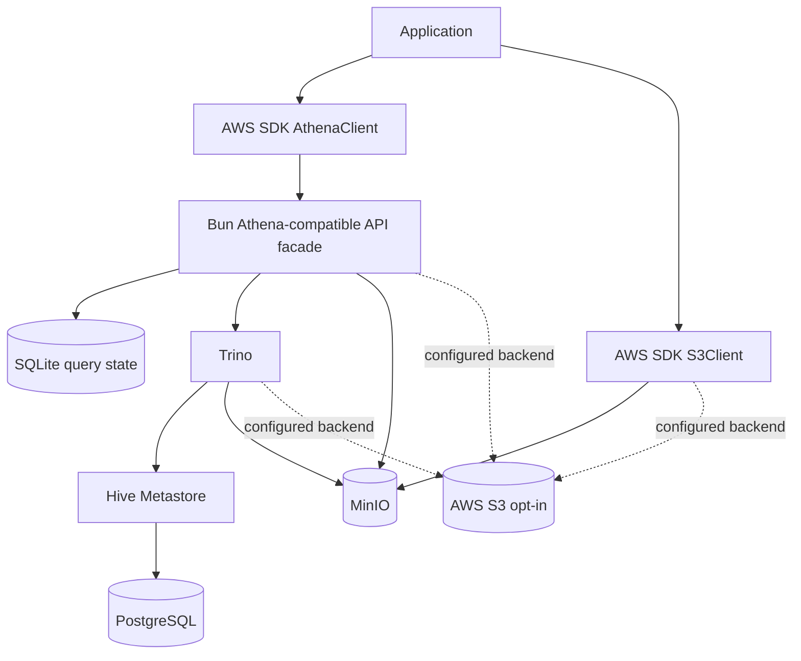

# Athena Local

**Run your real AWS Athena code path on your laptop — no AWS account in the loop.**

Athena Local is an Athena-compatible API server backed by [Trino](https://trino.io). Your application keeps using the real AWS SDK `AthenaClient` and `S3Client`; the only things that change between local and production are the endpoint, credentials, and region. No local-only code paths, no hand-written fakes, no `if (isLocal)` branches in your data layer.

```ts
// The exact client construction your tests and production share.
const athena = new AthenaClient({
  region: "us-east-1",
  endpoint: process.env.ATHENA_ENDPOINT, // http://127.0.0.1:4567 locally, unset in prod
});

await athena.send(
  new StartQueryExecutionCommand({
    QueryString: "select id, label from athena_local_smoke limit 10",
  }),
);
```

That's the whole idea: **the data-access code you ship is the data-access code you tested.**

## Why Athena Local exists

Amazon Athena is a managed service. There is no "Athena in a box," which leaves teams two bad options for local development and CI:

1. **Point tests at real Athena.** Every run needs AWS credentials and network access, costs money per query, leaves artifacts in real S3, is slow, and turns CI into a flaky, billable dependency on a remote region.
2. **Hide Athena behind an interface and write a local fake.** The fake drifts from real Athena — different SQL dialect, result shapes, pagination and error semantics — and the production path that actually talks to Athena is *never exercised until you deploy*. The bugs you were trying to catch live precisely in the gap between the fake and the real thing.

Both share one root flaw: **the code that runs in production is not the code you test locally.** Athena Local closes that gap with a third option — a process that speaks Athena's wire protocol, so the real SDK talks to it unmodified, and queries run on a real SQL engine.

## How it compares

| Option | Real SDK path | Real SQL engine | Cost / footprint |
| --- | :---: | :---: | --- |
| Real Athena in CI | ✅ | ✅ | $ per query, AWS creds, network, slow, flaky |
| Mocks (moto / hand-rolled fakes) | ✅ | ❌ mocks the API, runs no SQL | free, but drifts from real behavior |
| App → Trino directly | ❌ local-only client path | ✅ | free, but reintroduces the `if (isLocal)` fork |
| Multi-service emulators | ✅ | varies | Athena emulation is typically a paid tier; broad, heavyweight |
| **Athena Local** | ✅ | ✅ Trino | **free & open source (AGPL-3.0), single-purpose, runs on your machine** |

Athena Local is intentionally *narrow*: it does one thing — make your Athena-backed data layer runnable and testable locally through the real SDK — and tries to do it without lying. (Comparisons reflect the landscape at the time of writing; verify current details for your stack.)

## Who it is for

- Teams whose services query data through AWS Athena and want a local loop that exercises the **real** SDK path.
- CI pipelines that need Athena integration coverage without AWS credentials, network, or per-query cost.
- Anyone who wants a fast local query loop over realistic seeded fixtures instead of a mock that drifts.
- Projects that need deterministic, reproducible Athena/S3 behavior across every contributor's machine.

**On languages:** Athena Local is implemented in Bun/TypeScript and ships as an npm CLI, and the TypeScript path is the first-class, contract-tested client. But because the facade speaks Athena's **HTTP wire protocol**, any AWS SDK that targets a custom endpoint — Python (`boto3`), JVM, Go, Rust, the AWS CLI — can point at it. Non-TS SDKs share the same protocol but aren't part of the automated contract suite yet; treat them as supported-by-design, validated-by-you.

## How it works



The Bun facade receives Athena API requests, persists lifecycle state in SQLite, submits SQL to Trino over its HTTP statement protocol, follows Trino `nextUri` responses to completion, maps Trino results into Athena response shapes, and writes result files to the configured object store. Catalog metadata lives in Hive Metastore (backed by PostgreSQL); data lives in MinIO by default, or an opt-in, prefix-scoped real S3 bucket.

This is **application-integration parity, not a full AWS emulator** — see [Known Limitations](#known-limitations) for exactly where the line is drawn.

## Quick Start

```bash
bunx athena-local configure   # pick runtime, storage, ports (interactive)
bunx athena-local doctor       # verify the host is ready
bunx athena-local start        # bring up the stack + serve the facade
bunx athena-local seed         # create buckets, catalog, partitions, fixtures
```

> **First run is slower than later ones** — `start` pulls container images and Trino's JVM takes some seconds to report ready. `athena-local doctor` shows readiness; if `start` reports a readiness timeout, re-run `doctor` and check the Trino container logs (`docker logs athena-local-trino`, or `container logs athena-local-trino` on Apple `container`).

Confirm it end to end against the seeded data, using the real SDK:

```ts
import {
  AthenaClient,
  StartQueryExecutionCommand,
  GetQueryExecutionCommand,
  GetQueryResultsCommand,
} from "@aws-sdk/client-athena";

const athena = new AthenaClient({
  region: "us-east-1",
  endpoint: "http://127.0.0.1:4567",
  credentials: { accessKeyId: "local", secretAccessKey: "local-secret" },
});

const { QueryExecutionId } = await athena.send(
  new StartQueryExecutionCommand({
    QueryString: "select id, label from athena_local_smoke limit 10",
  }),
);

for (;;) {
  const { QueryExecution } = await athena.send(
    new GetQueryExecutionCommand({ QueryExecutionId }),
  );
  const state = QueryExecution?.Status?.State;
  if (state === "SUCCEEDED") break;
  if (state === "FAILED" || state === "CANCELLED")
    throw new Error(QueryExecution?.Status?.StateChangeReason);
  await new Promise((r) => setTimeout(r, 250));
}

const { ResultSet } = await athena.send(
  new GetQueryResultsCommand({ QueryExecutionId, MaxResults: 1000 }),
);
console.log(ResultSet?.Rows); // → seeded rows, materialized to object storage
```

Then point your own application at the same endpoints and run it unchanged — see [Configuration](#configuration-and-endpoints).

## Stability

Every operation in the [support matrix](#aws-sdk-athena-api-support-matrix) is implemented and tested against the real AWS SDK. Where behavior is approximate or intentionally unsupported, it is **documented rather than silently faked**. Changes are recorded in [CHANGELOG.md](CHANGELOG.md).

**SDK support window:** the protocol and end-to-end suites are run weekly against `@aws-sdk/client-athena` from the declared floor (`3.1071.0`) through `latest`, so SDK drift is caught before it reaches you. See the SDK Compatibility workflow.

## AWS SDK Athena API Support Matrix

The `@aws-sdk/client-athena` client exposes ~70 operations. Athena Local implements the ones an application's data-access code calls at runtime — and rejects the rest with a structured `InvalidRequestException` (`Unsupported Athena operation: <name>`) so code fails loudly instead of trusting a fake.

**Scope, in one sentence:** Athena Local implements the operations that **run queries, read their results, and read the execution / workgroup / catalog metadata** the SDK and tooling expect at runtime. Operations that **create or govern AWS-managed resources** — workgroup policies, data-catalog registration, named queries, capacity, notebooks/Spark, tagging — are out of scope, because there is no managed resource to govern locally. That principle, not a feature count, decides what's in.

**Implementation type:** **Full** = backed by the real engine (Trino) and persisted state, behaving like Athena for the supported surface. **Unsupported** = routed but explicitly rejected. **Not planned / Not yet** = outside current scope (see notes).

### Implemented

| Operation | Implementation | Tested by | Notes |
| --- | --- | --- | --- |
| `StartQueryExecution` | Full | `e2e`, `protocol`, `unit` | Submits SQL to Trino asynchronously; returns an execution ID; honors `ClientRequestToken` idempotency and `ResultConfiguration.OutputLocation`. |
| `GetQueryExecution` | Full | `e2e`, `integration`, `protocol`, `unit` | Returns state (`QUEUED`/`RUNNING`/`SUCCEEDED`/`FAILED`/`CANCELLED`), context, output location, `StateChangeReason`, statistics. |
| `GetQueryResults` | Full | `e2e`, `integration`, `unit` | Returns `ResultSetMetadata`, header row, data rows; `MaxResults` + opaque `NextToken` pagination. |
| `StopQueryExecution` | Full | `integration`, `protocol`, `unit` | Cancels the running Trino query and persists `CANCELLED`. |
| `BatchGetQueryExecution` | Full | `protocol`, `unit` | Returns `QueryExecutions` for known IDs; unknown IDs under `UnprocessedQueryExecutionIds`. |
| `ListQueryExecutions` | Full | `protocol`, `unit` | Execution IDs most-recent-first; `MaxResults` + `NextToken`; optional `WorkGroup` filter. |
| `GetWorkGroup` | Full | `protocol`, `unit` | Reports the configured result `OutputLocation` for the workgroup. Local config only — no enforcement. |
| `ListWorkGroups` | Full | `protocol`, `unit` | Returns the single default local workgroup summary. |
| `GetDatabase` | Full | `protocol`, `unit` | Resolves a database via Trino `information_schema`; `MetadataException` when absent. |
| `ListDatabases` | Full | `protocol`, `unit` | Lists databases from `information_schema` (excludes the system schema); paginated. |
| `GetTableMetadata` | Full | `protocol`, `unit` | Returns a table's columns (name + type) from `information_schema` (see type note). |
| `ListTableMetadata` | Full | `protocol`, `unit` | Lists a database's tables with columns; `Expression` substring filter + pagination. |

**Catalog operation notes:** `CatalogName` is accepted but the local stack exposes a single catalog (Hive via Trino) and resolves against it. Column `Type` is the Trino `information_schema` type (e.g. `integer`, `varchar`) — close to but not byte-identical with Athena/Hive type names — and `PartitionKeys` appear in `Columns` rather than split out. Database/table names are validated as plain identifiers (`[A-Za-z_][A-Za-z0-9_]*`) before reaching `information_schema`, so metadata lookups have no SQL-injection surface.

### Not implemented

Every operation below is routed and rejected with `InvalidRequestException` — never partially emulated.

| Capability area | Operations | Why |
| --- | --- | --- |
| Batch / saved-query lookups | `BatchGetNamedQuery`, `BatchGetPreparedStatement` | Batch reads over features that are themselves out of scope. |
| Runtime statistics | `GetQueryRuntimeStatistics` | Detailed per-stage Trino stats aren't surfaced through the Athena shape. |
| Workgroup management | `CreateWorkGroup`, `UpdateWorkGroup`, `DeleteWorkGroup` | The local workgroup is read-only — no policy/limit to manage. |
| Data Catalog registration | `CreateDataCatalog`, `GetDataCatalog`, `UpdateDataCatalog`, `DeleteDataCatalog`, `ListDataCatalogs` | The local catalog is fixed (Hive via Trino) — nothing to register or switch. |
| Prepared statements | `CreatePreparedStatement`, `GetPreparedStatement`, `UpdatePreparedStatement`, `DeletePreparedStatement`, `ListPreparedStatements` | **Coming soon** — on the near-term roadmap (see [Prepared statements](#prepared-statements-coming-soon)). |
| Named queries | `CreateNamedQuery`, `GetNamedQuery`, `UpdateNamedQuery`, `DeleteNamedQuery`, `ListNamedQueries` | Saved-query management isn't part of the execution path. |
| Notebooks & Spark sessions | `CreateNotebook`, `ImportNotebook`, `ExportNotebook`, `UpdateNotebook`, `DeleteNotebook`, `GetNotebookMetadata`, `UpdateNotebookMetadata`, `ListNotebookMetadata`, `ListNotebookSessions`, `CreatePresignedNotebookUrl`, `StartSession`, `GetSession`, `GetSessionStatus`, `GetSessionEndpoint`, `ListSessions`, `TerminateSession` | The PySpark/notebook engine isn't part of an SQL-on-Trino facade. |
| Calculations (Spark) | `StartCalculationExecution`, `StopCalculationExecution`, `GetCalculationExecution`, `GetCalculationExecutionCode`, `GetCalculationExecutionStatus`, `ListCalculationExecutions` | Spark calculation execution is out of scope. |
| Capacity reservations | `CreateCapacityReservation`, `GetCapacityReservation`, `UpdateCapacityReservation`, `CancelCapacityReservation`, `DeleteCapacityReservation`, `ListCapacityReservations`, `GetCapacityAssignmentConfiguration`, `PutCapacityAssignmentConfiguration` | Provisioned capacity is an AWS billing/scheduling concept with no local equivalent. |
| Engine / executors / DPU | `ListEngineVersions`, `ListExecutors`, `ListApplicationDPUSizes`, `GetResourceDashboard` | AWS-managed runtime metadata. |
| Tagging | `TagResource`, `UntagResource`, `ListTagsForResource` | No AWS resource model to tag locally. |

> Need one of these? Open an issue describing the use case. The bar for adding an operation is a real application-integration need plus AWS SDK contract coverage — not breadth for its own sake.

### Prepared statements (coming soon)

Prepared statements — `CreatePreparedStatement` … `ListPreparedStatements`, plus the `EXECUTE … USING` form via `ExecutionParameters` — are on the near-term roadmap. The facade already accepts `ExecutionParameters`; the remaining work is a small, well-tested parameter-binding layer that substitutes strictly-typed, escaped values into the stored statement (Trino's native `PREPARE`/`EXECUTE` is session-scoped, so binding happens in the facade). Until it ships, these operations route to the standard unsupported-operation error.

## Known Limitations

Athena Local targets application-integration parity. Knowing precisely where it stops is part of using it correctly — these are deliberate boundaries, not bugs. This is the single source of truth for behavioral fidelity.

**Query engine & SQL**
- Queries run on **Trino**, not Athena's managed engine. Athena's SQL is Trino/Presto-derived, so most analytical queries behave identically — but engine-specific functions, reserved words, type coercions, and edge-case semantics can differ. Treat real Athena as the source of truth for anything subtle.
- **DDL is not translated.** Athena DDL (e.g. `CREATE EXTERNAL TABLE … ROW FORMAT SERDE`) and Trino DDL differ; define local schemas with Trino-dialect DDL or seed files, not by replaying Athena DDL verbatim.
- No federated/connector queries, no `UNLOAD`, no prepared-statement execution.

**Catalog & storage**
- **Hive Metastore stands in for the Glue Data Catalog.** Glue-specific features (crawlers, classifiers, Glue APIs, automatic partition discovery) aren't emulated — you manage partitions explicitly.
- The local object store is **MinIO** by default; Athena Local never ships a custom S3 server. S3 semantics are exactly MinIO's (or real S3 when opted in).

**API surface & auth**
- Only the operations in the [support matrix](#aws-sdk-athena-api-support-matrix) are implemented; others return an unsupported-operation error.
- **SigV4 signatures are accepted but not verified.** Requests are routed by `X-Amz-Target`; the facade does not authenticate or authorize. **This is a local development tool — do not expose it as a network service.**
- **Workgroup enforcement is minimal** — workgroups are recorded for response shape, not enforced for limits, encryption, or output-location overrides.

**Statistics & fidelity**
- `DataScannedInBytes` and timing statistics are **best-effort** and reflect Trino, not Athena's billing meter — never use them for cost assertions.
- Error messages are Athena-*shaped* (correct exception names and envelopes) but not guaranteed byte-for-byte identical to AWS.

**Not in scope (by design)**
- IAM / resource policies, Lake Formation, KMS, CloudWatch metrics, Athena billing, throttling parity, Glue crawlers.

For AWS-specific edge cases, opt-in [AWS contract tests](#testing) against a real, isolated S3 prefix remain the authoritative check.

## Prerequisites

- Bun
- Git
- One supported container runtime:
  - Apple `container` (macOS), or
  - Docker Engine / Docker Desktop

Docker Compose is not required.

| Platform | Runtimes | Storage |
| --- | --- | --- |
| macOS | Apple `container` or Docker | MinIO, opt-in AWS S3 |
| Linux | Docker | MinIO, opt-in AWS S3 |
| Windows | Not supported directly | — |

## Configuration and endpoints

### Endpoints

Two layers configure separately: the **tool** (how Athena Local builds the stack) via `ATHENA_LOCAL_*`, and **your app** (how it reaches the running stack) via the AWS SDK.

| What | Variable | Notes |
| --- | --- | --- |
| Athena facade (app → facade) | `ATHENA_ENDPOINT` | App convention used by these examples. The AWS SDK also auto-reads the standard `AWS_ENDPOINT_URL_ATHENA` if you prefer no app code. |
| S3 / MinIO (app → storage) | `S3_ENDPOINT` | App convention. The SDK-standard equivalent is `AWS_ENDPOINT_URL_S3`. Use path-style addressing locally. |
| Region | `AWS_REGION` | Any region string; not validated locally. |
| Credentials | `AWS_ACCESS_KEY_ID` / `AWS_SECRET_ACCESS_KEY` | Any non-empty values for MinIO/local. SigV4 is not verified. |

```bash
export AWS_REGION=us-east-1
export AWS_ACCESS_KEY_ID=local
export AWS_SECRET_ACCESS_KEY=local-secret
export ATHENA_ENDPOINT=http://127.0.0.1:4567
export S3_ENDPOINT=http://127.0.0.1:9000
```

### Tool configuration

Athena Local separates configuration by responsibility — committed project config, uncommitted local developer config, secrets, environment overrides, and generated runtime state. **Secrets are never written to committed files.**

Precedence (both for tool config and runtime selection): **CLI flags → environment variables → local config → committed project config → defaults** (runtime selection then falls back to auto-detection, then a TTY prompt).

| Variable | Purpose |
| --- | --- |
| `ATHENA_LOCAL_CONTAINER_RUNTIME` | `apple-container` or `docker` |
| `ATHENA_LOCAL_STORAGE_BACKEND` | `minio` (default), `s3`, or `external` |
| `ATHENA_LOCAL_S3_BUCKET` | Bucket for the `s3` / `external` backend |
| `ATHENA_LOCAL_S3_PREFIX` | Required scoped development prefix for the `s3` backend |
| `ATHENA_LOCAL_S3_ENDPOINT` | `external` backend: the object store Trino reads (a `localhost`/`127.0.0.1` endpoint is auto-rewritten — and logged — to the container→host gateway so Trino can reach a host service) |
| `ATHENA_LOCAL_S3_ACCESS_KEY` / `_SECRET_KEY` | `external` backend static creds (MinIO-style); for real S3 prefer the AWS credential chain |
| `AWS_PROFILE` | Optional AWS profile (real-S3 workflows) |
| `AWS_ENDPOINT_URL_S3` | Custom S3 endpoint, only when explicitly configured |

Host ports (override when defaults conflict):

| Variable | Service | Default |
| --- | --- | --- |
| `ATHENA_LOCAL_PORT_ATHENA` | Athena facade | `4567` |
| `ATHENA_LOCAL_PORT_MINIO` | MinIO S3 API | `9000` |
| `ATHENA_LOCAL_PORT_MINIO_CONSOLE` | MinIO console | `9001` |
| `ATHENA_LOCAL_PORT_TRINO` | Trino HTTP | `8080` |
| `ATHENA_LOCAL_PORT_HIVE_METASTORE` | Hive Metastore thrift | `9083` |
| `ATHENA_LOCAL_PORT_POSTGRES` | PostgreSQL | `5432` |

The facade derives its Trino and MinIO endpoints from these ports. To attach to services already running elsewhere, set `TRINO_ENDPOINT`, `ATHENA_LOCAL_MINIO_ENDPOINT` (or `S3_ENDPOINT`), and `ATHENA_LOCAL_STATE_PATH` directly — these take precedence over the derived defaults.

## CLI reference

| Command | What it does |
| --- | --- |
| `configure` | Create/update local configuration (interactive only in a TTY). |
| `doctor` | Check runtime availability, versions, port conflicts, service health, storage config, credentials source, writable dirs, unsupported host conditions. |
| `start` | Create or start the services for the selected mode. |
| `stop` | Stop services **without** deleting persistent data. |
| `status` | Report service state, ports, health, storage backend, configured endpoints. |
| `reset` | Recreate local project state and fixtures. (Never touches remote S3.) |
| `destroy` | Remove local services and local data, after explicit intent. |
| `seed` | Create buckets, catalog metadata, partitions, and deterministic fixtures. |

All commands accept `--json` where useful, return stable exit codes, and redact secrets from output. CI and scripts should drive everything noninteractively:

```bash
ATHENA_LOCAL_CONTAINER_RUNTIME=docker \
ATHENA_LOCAL_STORAGE_BACKEND=minio \
athena-local start --json
```

No command blocks on input when stdin/stdout isn't a TTY.

## Runtimes

### Apple `container` (macOS)

Runs the full stack — MinIO, Trino, Hive Metastore, and PostgreSQL — through the shared runtime abstraction; the Bun facade can run on the host for fast iteration. Inter-service and host reachability go through the discovered host gateway, so **no DNS-domain setup or `sudo` is required** — just start:

```bash
athena-local start --runtime apple-container
```

### Docker

Docker Engine or Docker Desktop through the same abstraction; Docker Compose is not required.

```bash
athena-local start --runtime docker
```

## Storage backends

| Backend | Use case |
| --- | --- |
| **MinIO** | Default — bundled, offline local development and CI. Use path-style access. |
| **AWS S3** | Opt-in — workflows that need real buckets, with a required scoped development prefix. |
| **External** | Attach to an object store you already run (an existing MinIO, or real S3). athena-local supplies Trino + Hive Metastore + catalog and queries **your** data — it does not start its own MinIO. See [Querying an existing object store](#querying-an-existing-object-store-external-mode). |

Local S3 client for MinIO:

```ts
import { S3Client } from "@aws-sdk/client-s3";

export const s3 = new S3Client({
  region: "us-east-1",
  endpoint: "http://127.0.0.1:9000",
  forcePathStyle: true,
  credentials: { accessKeyId: "local", secretAccessKey: "local-secret" },
});
```

Opt-in real S3:

```bash
export ATHENA_LOCAL_STORAGE_BACKEND=s3
export ATHENA_LOCAL_S3_BUCKET=my-dev-bucket
export ATHENA_LOCAL_S3_PREFIX=athena-local/dev/
export AWS_PROFILE=development
export AWS_REGION=us-east-1
```

Use the standard AWS credential chain for real S3 — profiles, environment credentials, SSO, OIDC, or role-based mechanisms (static local creds are fine only for MinIO). Athena Local never logs credentials, Authorization headers, or signed URLs.

**Remote S3 safety** is intentionally conservative: empty prefixes, root-level operations, and bucket deletion are rejected; destructive actions require force/confirmation (explicit flags when noninteractive); cleanup is scoped to the configured prefix; local `reset`/`destroy` never touch remote data.

### Querying an existing object store (external mode)

To query data you **already have** — an existing MinIO, or a real S3 bucket — rather than seeding fixtures, attach to it. athena-local supplies Trino + Hive Metastore + its own catalog Postgres and points Trino at your store; it does not start its own MinIO. This is also how you point athena-local at real AWS S3.

```bash
export ATHENA_LOCAL_STORAGE_BACKEND=external
export ATHENA_LOCAL_S3_ENDPOINT=http://127.0.0.1:9000   # your store; localhost → container→host gateway automatically
export ATHENA_LOCAL_S3_BUCKET=my-existing-bucket
export ATHENA_LOCAL_S3_ACCESS_KEY=...                    # MinIO-style static creds; for real S3, use the AWS credential chain
export ATHENA_LOCAL_S3_SECRET_KEY=...
# In external mode the catalog Postgres auto-defaults to 5433 (off a 5432 you may
# already run); set ATHENA_LOCAL_PORT_POSTGRES only to override it.
athena-local start
```

Then register a table over your data and make its partitions visible. Both ride the normal `StartQueryExecution` path, so you issue them through the **real `AthenaClient`** — no special API:

- **Register** an external table with Trino-dialect DDL, e.g.
  `CREATE TABLE events (…) WITH (external_location = 's3://my-existing-bucket/events/', format = 'JSON', partitioned_by = ARRAY['account_id','dt'])`.
- **Sync partitions** as new ones arrive:
  `CALL system.sync_partition_metadata('<schema>', '<table>', 'ADD')`. Trino/Hive has no Athena-style partition projection, so partitions are registered explicitly — call sync before querying newly-written data.

`QueryExecutionContext.Database` is honored **per query**, so your application keeps using bare table names with the database set on the request — no fully-qualified names and no global default-schema env required. Both `s3://` (the scheme real Athena uses) and `s3a://` external-table locations work.

> **Known limit:** external mode currently assumes a path-style, `us-east-1`-style store (ideal for MinIO). Attaching to **real AWS S3 in another region or with virtual-hosted addressing** needs the store's region/addressing parameterized from `ATHENA_LOCAL_S3_*` — that's a pending follow-up, not yet wired.

## Modes

- **Test mode** — deterministic, isolated, noninteractive: generated run IDs, isolated networks/state, explicit timeouts, machine-readable output, fast reset, automatic cleanup. Pure unit tests run with **no** containers, Trino, MinIO, Docker, network, or live AWS.
- **Persistent development mode** — stable ports and persistent volumes for MinIO, Hive Metastore, PostgreSQL, and Athena query state, for a locally running app over longer sessions. `stop` keeps data; `reset` recreates state; `destroy` removes services and data after explicit intent.

## Testing

```bash
bun test
bun run test:unit        bun run test:protocol     bun run test:sqlite
bun run test:integration bun run test:e2e          bun run test:aws
bun run test:docker      bun run test:apple-container
bun run test:package     bun run test:release
bun run typecheck        bun run lint              bun run format:check
```

Most suites need no infrastructure: `test:unit`, `test:protocol`, `test:sqlite`, `test:integration`, and `test:e2e` use deterministic fakes (in-memory storage, a scripted Trino, and a real AWS SDK client wired to the in-process facade), so they pass offline and in CI without containers or credentials.

The runtime and AWS suites do real work only when their dependency is present, and otherwise skip:

- `test:docker` / `test:apple-container` exercise live runtime detection when the Docker daemon or Apple `container` CLI is available.
- `test:aws` is opt-in — skipped unless `ATHENA_LOCAL_AWS_TEST=1` is set with `ATHENA_LOCAL_S3_BUCKET` and `ATHENA_LOCAL_S3_PREFIX`, operating only within that scoped prefix.

**Full-stack end-to-end:** `test/e2e/live-stack.test.ts` drives a real `AthenaClient` against a running stack (facade + Trino + Hive Metastore + MinIO) and asserts the seeded table is queryable with results written to object storage. Skipped unless `ATHENA_LOCAL_LIVE=1`:

```bash
bun run src/cli.ts start --runtime docker &   # bring up the stack + facade
bun run src/cli.ts seed  --runtime docker
ATHENA_LOCAL_LIVE=1 bun test test/e2e/live-stack.test.ts
bun run src/cli.ts destroy --runtime docker
```

The `Integration` GitHub Actions workflow runs exactly this on Docker for every push to `main` (and on PRs labeled `integration`).

## Troubleshooting

Start with the machine-readable health views:

```bash
athena-local doctor --json
athena-local status --json
```

Common issues: selected runtime not installed · port conflicts · unwritable state directories · MinIO bucket not initialized · Trino not ready (often just first-run JVM warmup — see [Quick Start](#quick-start)) · Hive Metastore not reachable · AWS profile unavailable inside the runtime · S3 prefix rejected by safety validation.

## Security considerations

- Do not commit credentials; do not log Authorization headers or signed URLs.
- Use explicit prefixes for remote storage; keep local reset separate from remote cleanup.
- Validate user-controlled paths and identifiers; scope destructive operations to a project/run namespace.
- Avoid shell invocation for subprocesses where possible.
- The facade does not verify SigV4 — **never expose it as a network service.**

## Development

```bash
bun install
bun run typecheck
bun test
bun run format:check
```

See [CONTRIBUTING.md](CONTRIBUTING.md).

## Release & versioning

Releases publish through GitHub Actions using npm provenance (or another short-lived identity mechanism); developer-workstation publishing is not the normal path. Athena Local follows semantic versioning, with compatibility changes, migration notes, and deprecations recorded in [CHANGELOG.md](CHANGELOG.md). Support policy: [SUPPORT.md](SUPPORT.md).

## License

Athena Local is free and open source under the **GNU Affero General Public License v3.0** — see [LICENSE](LICENSE). If you run a modified version as a network service, the AGPL requires you to make your changes available under the same license.

Need to use Athena Local without AGPL obligations? **Commercial licensing may be available** — contact the maintainer. Contributors agree to the [Contributor License Agreement](CLA.md).

## Trademark and non-affiliation

AWS, Amazon Athena, Amazon S3, and related marks are trademarks of Amazon.com, Inc. or its affiliates. Athena Local is an independent open-source project and is not affiliated with, endorsed by, sponsored by, or supported by Amazon Web Services.
