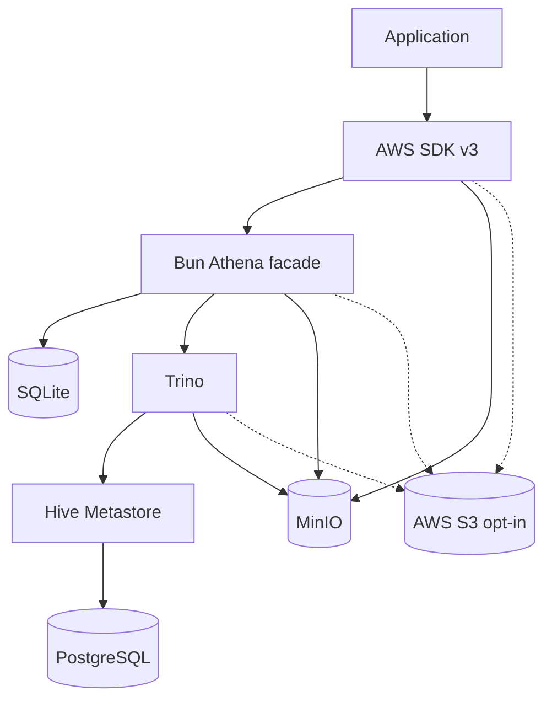

# MVP Implementation Plan

## 1. Executive Summary

Athena Local will provide a Bun-native, AWS Athena API-compatible local development service backed by Trino. Applications will continue using the real AWS SDK v3 `AthenaClient` and `S3Client`; only endpoint, credentials, region, bucket, and environment configuration change between local and production.

The MVP is intentionally narrow: support `StartQueryExecution`, `GetQueryExecution`, `GetQueryResults`, and `StopQueryExecution` with persisted state, Trino execution, result pagination, CSV materialization, MinIO by default, opt-in AWS S3, and a CLI that manages local infrastructure through Apple `container` or Docker.

## 2. Project Scope

- Bun-only TypeScript implementation.
- AWS JSON protocol facade for the initial Athena operations.
- Trino HTTP statement protocol client.
- SQLite query execution state.
- MinIO and AWS S3 storage backends.
- Hive Metastore and PostgreSQL catalog services.
- Apple `container` and Docker runtime adapters.
- Test and persistent development modes.
- Public documentation, repository metadata, CI, and release planning.

## 3. Explicit Non-Goals

- No general AWS emulator.
- No full Athena API implementation.
- No full Glue API implementation.
- No IAM, Lake Formation, KMS, billing, or CloudWatch emulation.
- No custom S3-compatible server.
- No DuckDB.
- No Docker Compose requirement.
- No exact bytes-scanned or error-message parity.
- No production feature claims without AWS SDK integration coverage.

## 4. Architecture

The application sends SDK requests to local endpoints. S3 requests go to MinIO by default or opt-in AWS S3. Athena requests go to the Bun facade, which persists state in SQLite, submits SQL to Trino, reads catalog metadata through Trino/Hive Metastore, and writes result files to the configured object store.

## 5. Package And Workspace Structure

Use a single Bun package initially, with source organized by subsystem:

- `src/cli/` for CLI parsing and command dispatch.
- `src/config/` for typed configuration.
- `src/runtime/` for shared runtime interfaces and adapters.
- `src/storage/` for object-storage interfaces.
- `src/protocol/` for AWS JSON protocol types and routing.
- `src/state/` for SQLite schema and repositories.
- `src/trino/` for Trino protocol types and client.
- `src/results/` for row conversion, CSV, pagination, and materialization.
- `test/` for unit, protocol, SQLite, adapter, and integration tests.
- `docs/` for architecture, plans, and compatibility notes.

Avoid splitting into workspaces until multiple independently versioned packages are justified.

## 6. Public APIs

The initial public surface is the CLI and documented local endpoints.

The package should expose:

- CLI binary: `athena-local`.
- Minimal package metadata export for version/help tests.
- No stable library API until actual consumers need one.

Internal TypeScript interfaces may change before `1.0`.

## 7. AWS JSON Protocol Handling

The facade accepts AWS SDK Athena requests:

- `POST /`
- `Content-Type: application/x-amz-json-1.1`
- `X-Amz-Target: AmazonAthena.<Operation>`
- signed Authorization header accepted but not verified in MVP

Routing is target-header based. Unsupported operations return AWS-compatible error envelopes. Malformed JSON, missing target, missing required fields, and invalid types get deterministic structured errors.

## 8. Supported Athena Operations

MVP operations:

- `StartQueryExecution`
- `GetQueryExecution`
- `GetQueryResults`
- `StopQueryExecution`

No other Athena operation is supported unless a later milestone adds it with SDK integration coverage.

## 9. Execution State Machine

States:

- `QUEUED`: accepted and persisted, not yet submitted or worker not started.
- `RUNNING`: submitted to Trino and not terminal.
- `SUCCEEDED`: Trino completed, results were materialized, metadata is available.
- `FAILED`: validation, Trino, storage, or internal execution failure.
- `CANCELLED`: cancellation requested and persisted.

Terminal states are immutable except for retention cleanup.

## 10. SQLite Schema And Migrations

Use `bun:sqlite` with WAL where appropriate.

Core tables:

- `schema_version`
- `query_execution`
- `query_result_page` if result paging is stored separately
- `idempotency_token`

Persist query text, context, workgroup, output location, lifecycle timestamps, Trino query ID, current `nextUri`, result metadata, row counts, statistics, errors, and cancellation state.

## 11. Restart And Recovery Behavior

On startup:

- terminal executions remain terminal.
- `QUEUED` executions may be failed as abandoned or requeued according to config.
- `RUNNING` executions without a resumable Trino handle become `FAILED` with a restart reason unless a safe poll/cancel path exists.
- cleanup policy applies only after state reconciliation.

The MVP should choose conservative failure over pretending a query continued when authoritative state is unavailable.

## 12. Trino Client Protocol

Use native `fetch()`.

Flow:

1. Submit SQL to `/v1/statement`.
2. Store Trino query ID and `nextUri`.
3. Poll `nextUri` until absent.
4. Accumulate or spool rows.
5. Map stats and errors.
6. Use Trino cancellation protocol when stopping a running query.

Most tests should use a deterministic fake Trino protocol server.

## 13. Result Conversion

Convert Trino columns and data into Athena-compatible `ResultSet` rows.

Rules:

- header row appears first.
- scalar values serialize as strings.
- null cells use empty datum objects.
- decimals preserve precision.
- dates, timestamps, booleans, binary, arrays, maps, rows, and JSON have explicit documented formatting.

Unsupported edge cases fail clearly or are documented as compatibility limits.

## 14. Pagination And Tokens

`GetQueryResults` supports:

- `MaxResults`
- opaque `NextToken`
- token validation
- query ID binding
- tamper detection if signed tokens are used

Tokens must not expose local file paths or secrets.

## 15. MinIO Result Materialization

Default local result output writes CSV to MinIO under a configured project/run prefix.

The facade returns an Athena-style `s3://bucket/key` output location. MinIO credentials are local development credentials only and must not be treated as production secrets.

## 16. AWS S3 Result Materialization

AWS S3 output is opt-in.

Requirements:

- explicit bucket
- explicit non-empty development prefix
- standard AWS credential provider chain where appropriate
- optional AWS profile and region
- no `AWS_ENDPOINT_URL_S3` unless explicitly configured
- no credential logging

## 17. Hive Metastore Strategy

Hive Metastore owns local catalog metadata and persists it in PostgreSQL. Trino uses the Hive connector to read table metadata and object locations.

Catalog initialization creates required databases, schemas, tables, and partitions through versioned migration or seed files.

## 18. DDL Compatibility

Athena DDL and Trino DDL differ. The MVP should use explicit dialect-specific migrations rather than a broad translator.

If a translator is later added, it must be constrained, tested against real Athena behavior, and documented as partial.

## 19. Apple Container Adapter

The adapter translates shared service definitions into Apple `container` CLI commands.

It covers detection, version parsing, image pull, network/volume/container lifecycle, readiness, logs, stop, reset, destroy, rollback, and status.

Real integration may be manual or self-hosted until GitHub-hosted macOS support is reliable.

## 20. Docker Adapter

The adapter translates the same shared service definitions into Docker CLI commands.

It supports Docker Engine and Docker Desktop where compatible. Docker Compose is not required.

Linux CI uses Docker for the primary full-stack suite.

## 21. Shared Runtime Abstraction

Define typed service definitions for image, command, environment, ports, volumes, health checks, dependencies, and cleanup behavior.

Adapters must avoid shell string construction where possible and execute argv arrays through a process-execution abstraction.

## 22. Runtime Detection

Detection order:

1. explicit CLI flag
2. environment variable
3. saved local config
4. automatic detection
5. interactive prompt only in TTY

If neither runtime is available, `doctor` explains supported installation paths and exits without side effects.

## 23. Interactive Setup

`athena-local configure` prompts only in TTY mode and only when required choices cannot be inferred safely.

It can choose runtime, storage backend, ports, persistent directories, project identifier, and seed set.

## 24. Noninteractive Setup

CI and scripts use flags, environment variables, and config files. Missing required values fail with actionable messages and stable exit codes.

No command blocks waiting for input when stdin/stdout is not a TTY.

## 25. Test-Mode Lifecycle

Test mode uses generated run identifiers, isolated networks/state, deterministic fixtures, explicit timeouts, fast reset, automatic cleanup, machine-readable output, and reliable exit codes.

Pure tests do not require containers or network access.

## 26. Persistent-Development Lifecycle

Development mode uses stable ports and persistent volumes for MinIO, Hive Metastore, PostgreSQL, and optionally Athena state.

`stop` stops services without deleting data. `reset` recreates local state. `destroy` removes local services and local data after explicit intent.

## 27. Object-Storage Abstraction

Define a storage contract for write, read, head, list by prefix, delete by scoped prefix, result materialization, fixture seeding, and redacted diagnostics.

Backends:

- MinIO
- AWS S3

## 28. MinIO Backend

MinIO is the default local backend and is managed by the selected container runtime unless externally configured later.

Use path-style access, local credentials, explicit buckets, readiness checks, and seed helpers.

## 29. AWS S3 Backend

AWS S3 backend uses real AWS APIs and credentials only after explicit configuration.

Support AWS profile, region, bucket, prefix, and standard credential provider behavior. Host AWS profile mounting into containers must be documented as runtime-specific and potentially limited.

## 30. S3 Safety Controls

Remote destructive actions:

- reject empty prefix
- reject `/`
- reject bucket root deletion
- require force flag or confirmation
- support noninteractive explicit force
- never run as part of local reset/destroy
- redact credentials and signed URLs
- optionally warn or block production-like names

## 31. Typed Configuration Schema

Configuration covers runtime, storage backend, execution mode, ports, hostnames, directories, project/run identifiers, AWS profile/region, S3 bucket/prefix, MinIO endpoint/credentials, Trino, Hive Metastore, PostgreSQL, seed settings, cleanup policy, timeouts, log level, and output mode.

Validation uses `unknown` inputs and explicit type guards or a lightweight schema dependency only if justified.

## 32. Configuration Files And Precedence

Proposed files:

- committed: `athena-local.config.json`
- uncommitted local: `.athena-local/config.local.json`
- generated runtime state: `.athena-local/state/`
- secrets: environment variables, AWS profile, or external secret manager

Precedence:

1. CLI flags
2. environment variables
3. local config
4. committed project config
5. defaults

## 33. CLI Design

Commands:

- `configure`
- `doctor`
- `start`
- `stop`
- `status`
- `reset`
- `destroy`
- `seed`

All commands support `--json` where useful, stable exit codes, and secret-redacted output.

## 34. Doctor Command

`doctor` checks selected runtime, detected runtimes, versions, required ports, port conflicts, service health, object-storage configuration, credentials-source status, writable directories, unsupported host conditions, and known safety risks.

## 35. Seed System

Seed commands create deterministic data, buckets, catalog objects, partitions, and query fixtures.

Seeds are repeatable and support incremental reseeding, full reset, and test-mode isolation.

## 36. Logging

Use structured logs. Redact Authorization headers, credentials, signed URLs, and sensitive environment values.

Log operation, query execution ID, state transitions, duration, runtime, storage backend, service health, and error categories.

## 37. Observability

Expose local health endpoints and machine-readable status. Track query lifecycle timestamps, scanned bytes where available, result row counts, retry counts, cancellation, and failure reasons.

## 38. Error Model

Return AWS-compatible error envelopes for protocol errors and Athena-compatible failed query states for execution errors.

Prioritize stable exception names, HTTP status codes, query state, retryability where meaningful, and useful local diagnostics.

## 39. README Structure

README must be production-quality but honest about current status.

It includes project name, purpose, audience, architecture, parity model, supported/planned/unsupported behavior, prerequisites, runtimes, storage backends, installation, quick start, setup modes, config, examples, lifecycle commands, troubleshooting, security, S3 safety, testing, development, contributing, release, license, and AWS disclaimer.

## 40. Documentation Lifecycle

Docs must distinguish implemented, planned, experimental, partially supported, unsupported, and not planned.

Where practical, validate command references, env var names, config examples, links, and compatibility tables in CI.

## 41. Unit-Test Inventory

Unit tests cover state transitions, validation, serialization, error envelopes, Trino-to-Athena mapping, type formatting, row encoding, pagination, token validation, idempotency, config precedence, runtime selection, TTY behavior, storage selection, S3 safety, path normalization, command construction, secret redaction, deterministic IDs/clocks, and restart logic.

## 42. Protocol Contract Tests

Protocol tests cover `X-Amz-Target` routing, supported and unsupported operations, malformed JSON, missing fields, invalid types, content types, status codes, request IDs, SDK serialization, and SDK deserialization.

Authoritative tests use `@aws-sdk/client-athena`.

## 43. SQLite Tests

SQLite tests cover schema creation, migrations, WAL, prepared statements, idempotent inserts, concurrent polling, state changes, restart recovery, cleanup, retention, migration failure, and isolated temporary databases.

## 44. Trino Tests

Trino tests cover submission, polling, multi-page responses, delayed columns, completion, failure, malformed responses, HTTP failures, cancellation, timeouts, retries, connection interruption, and processed-byte statistics.

## 45. Storage Tests

Storage tests cover MinIO and AWS S3 configuration without live AWS access, writes, reads, existence, materialization, fixtures, prefix scoping, cleanup, safeguards, redaction, path-style access, endpoint configuration, and region configuration.

Live AWS S3 tests are opt-in and isolated.

## 46. Runtime Adapter Tests

Adapter tests cover Apple `container` and Docker detection, version parsing, command generation, network/volume/container lifecycle, readiness, logs, stop, reset, destroy, rollback, port conflicts, and failure reporting.

Most adapter tests mock process execution.

## 47. Integration Test Matrix

Full stack tests verify facade, Trino, Hive Metastore, PostgreSQL, MinIO, seeded tables, object visibility, query submission, polling, pagination, materialization, cancellation, failure behavior, persistence, reset, and destroy.

## 48. End-To-End Tests

E2E tests use real AWS SDK v3 clients to upload data, submit Athena queries, poll, fetch all result pages, parse rows, inspect output locations, cancel queries, and receive structured failures.

## 49. Docker CI

Linux CI runs Docker-backed full integration and E2E suites. Docker adapter tests also run without containers through mocked process execution.

## 50. Apple Container CI

macOS CI runs Bun checks, pure tests, protocol tests, CLI tests, and Apple adapter command-generation tests.

Real Apple `container` integration is self-hosted, scheduled, release-validation, or manually verified unless GitHub-hosted runners support it reliably.

## 51. AWS Contract CI

AWS contract tests are opt-in, trusted-branch only, use GitHub OIDC where possible, least privilege roles, isolated prefixes, strict cleanup, cost safeguards, no long-lived keys, and safe diagnostics.

## 52. Packaging Tests

Package tests inspect the npm tarball for expected files and absence of secrets, `.env`, logs, SQLite DBs, AWS credentials, private files, and runtime state.

Install the tarball into a clean temp project and run CLI smoke tests.

## 53. npm Release Safety

Publishing happens from GitHub Actions, not developer workstations.

Release workflow checks out the tag, installs with frozen lockfile, runs checks/tests, builds, packs, inspects, smoke-tests, verifies version/tag, checks clean tree, generates checksums/SBOM, publishes with provenance, and attaches artifacts.

## 54. GitHub Actions Workflows

Planned workflows:

- `ci.yml`
- `integration.yml`
- `security.yml`
- `aws-contract.yml`
- `scheduled-compatibility.yml`
- `release.yml`

Responsibilities remain clear even if exact workflow split changes.

## 55. Branch Protection

Recommended manual settings:

- protected `main`
- required pull requests
- required reviews
- required checks
- branch freshness
- force-push prevention
- branch deletion prevention
- tag protection
- release approval
- npm trusted publishing
- GitHub OIDC
- private vulnerability reporting
- Dependabot alerts
- secret scanning
- push protection

## 56. Security Model

Local MinIO credentials may be non-secret development credentials. Real AWS credentials must use normal credential practices and must never be committed or logged.

The facade does not validate SigV4 in MVP but accepts signed SDK requests.

## 57. Supply-Chain Protections

Use lockfile integrity, dependency review, vulnerability scanning, known-malicious-package checks where available, license checks, pinned OCI images, pinned Actions where practical, shell-injection tests, path-traversal tests, secure temp directories, safe permissions, and no credentials in generated state.

## 58. Provenance And SBOM

Release artifacts should include npm provenance, GitHub artifact attestations where useful, checksums, and SBOM when the dependency/tooling footprint warrants it.

## 59. Coverage Expectations

Collect package-level coverage. Use reasonable thresholds after meaningful tests exist.

Prioritize branch coverage for state machines, pagination, token validation, destructive storage operations, configuration precedence, runtime selection, and error mapping.

## 60. Compatibility Policy

Compatibility claims require AWS SDK integration tests. Known deviations from AWS Athena must be documented in README and compatibility docs.

Breaking changes before `1.0` are allowed but must be noted in changelog entries.

## 61. Release Strategy

- alpha during early development
- beta after SDK contract behavior stabilizes
- `1.0` after all documented MVP operations and lifecycle behavior are reliable
- semantic versioning
- npm dist-tags
- changelog and migration notes
- deprecation policy for changed flags/config
- rollback/deprecation guidance for broken releases

## 62. Licensing

Use MIT License with copyright holder `Tim Wickstrom`.

Package metadata, README, and LICENSE must agree.

## 63. Trademark And Non-Affiliation Considerations

README and package metadata must state that AWS, Athena, S3, and related marks are trademarks of Amazon.com, Inc. or its affiliates, and this project is not affiliated with or endorsed by Amazon Web Services.

## 64. Risks

- Athena protocol edge cases not discovered until SDK/E2E tests.
- Trino/Athena DDL differences.
- Apple `container` CI availability.
- Safe real AWS S3 cleanup complexity.
- Large result memory pressure.
- Credential leakage in logs or package artifacts.
- Docker and Apple runtime behavior drift.
- Hive Metastore image/version compatibility.

## 65. Unresolved Decisions

- Exact Trino, Hive Metastore, PostgreSQL, and MinIO image versions.
- Whether result pages are stored as SQLite rows, files, or both.
- Exact opaque token signing method.
- Exact config file format after initial JSON.
- Minimum supported Bun version after CI validation.
- Whether to add a schema validation dependency or use handwritten validators.

## 66. Milestones

1. Repository foundation.
2. Typed configuration and CLI skeleton.
3. Runtime and storage interfaces.
4. SQLite state foundation.
5. AWS JSON Athena protocol.
6. Trino client and execution worker.
7. Results, materialization, and pagination.
8. Container-backed local stack.
9. End-to-end SDK compatibility.
10. AWS S3 opt-in backend and contract tests.
11. Release hardening.

## 67. Definition Of Done For Each Milestone

Each milestone ends with:

- working behavior for that milestone
- focused tests
- documentation updates
- verification commands
- no hidden dependency on future milestones unless explicitly documented

## 68. Definition Of Done For README

README is complete when it accurately distinguishes implemented, planned, experimental, partial, unsupported, and not planned behavior; includes architecture and compatibility tables; includes real SDK examples only when accurate; and documents lifecycle, safety, security, contributing, release, license, and trademark status.

## 69. Definition Of Done For Testing

Testing is complete for MVP when pure tests run without infrastructure, protocol tests use AWS SDK clients, integration tests cover local stack behavior, E2E tests prove SDK application paths, package tests inspect the tarball, and opt-in AWS tests validate non-local parity risks.

## 70. Definition Of Done For Release Readiness

Release readiness requires clean CI, documented compatibility, package tarball verification, no secret leaks, pinned release workflow, provenance, changelog, version/tag validation, README accuracy, license consistency, and explicit approval for npm publication.
